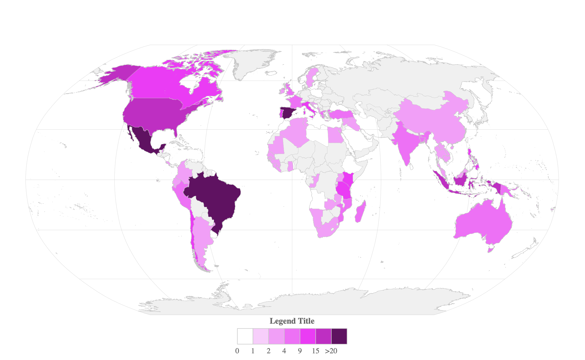

<!-- README.md is generated from README.Rmd. Please edit that file -->


```{r, include = FALSE}
knitr::opts_chunk$set(
  collapse  = TRUE,
  comment   = "#>",
  fig.path  = "man/figures/",
  out.width = "100%"
)
```


worldmap
=========================================================

<!-- badges: start -->
[](https://github.com/FRBCesab/worldmap/actions/workflows/R-CMD-check.yaml)
[](https://github.com/FRBCesab/worldmap/actions/workflows/pkgdown.yaml)
[](https://CRAN.R-project.org/package=worldmap)
[](https://choosealicense.com/licenses/mit)
[](https://www.repostatus.org/#active)
[](https://lifecycle.r-lib.org/articles/stages.html#stable)
[](#)
<!-- badges: end -->


This research compendium creates a chloropeth world map in the Robinson projection 
at the country level based on the IPBES Regions definition.


## Usage

1. Fork the clone onto your GitHub account
2. Clone your copy
3. Open the `.Rproj`
4. Run the `make.R`

All dependencies will be installed and a chloropeth map with the demo dataset 
will be saved in the folder **figures/**.



If all is good you can add your own dataset, adapt the script and re-launch the `make.R`.

Cheers!
